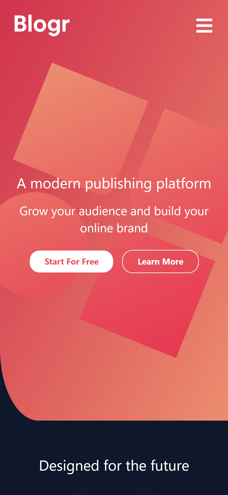

# Frontend Mentor - Blogr landing page solution

This is a solution to the [Blogr landing page challenge on Frontend Mentor](https://www.frontendmentor.io/challenges/blogr-landing-page-EX2RLAApP). Frontend Mentor challenges help you improve your coding skills by building realistic projects.

## Overview

### The challenge

Users should be able to:

- View the optimal layout for the site depending on their device's screen size
- See hover states for all interactive elements on the page

### Screenshot

### Links

- Solution URL: [Add solution URL here](https://github.com/Ausranking/Blogr-tech.git)
- Live Site URL: [Add live site URL here](https://blogr-tech.vercel.app/)

## My process

### Built with

- Flexbox
- CSS Grid
- Mobile-first workflow
- [React](https://reactjs.org/) - JS library
- Tailwindcss

### What I learned

Concept of React hooks, {useState} 
Js modules (Default and named exports)

### Continued development

Will improve the dropdown aspect soon

## Author

- Frontend Mentor - [@austranking](https://www.frontendmentor.io/profile/austranking)
- Twitter - [@King Austin](https://www.twitter.com/_kingaustinn_)

## Acknowledgments

kudos to the frontend mentor team, I always check in here to find a challege to work on
